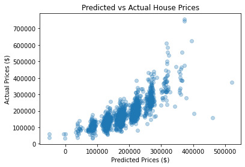
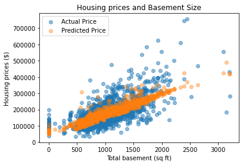
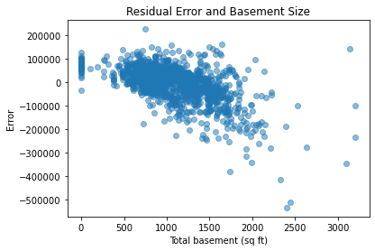
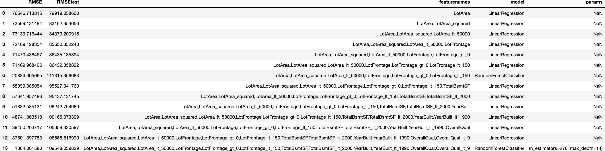

# Predicting Housing Prices Final Project Report

## Introduction

Understanding what makes a house worth a certain amount of money in a given time period, is extremely important for many stakeholders in this economy. Whether you are a homeowner, potential buyer, house flipper, real estate agent, or investor, having an accurate prediction of house prices ensures you are maximizing your gains and minimizing your losses.  In the United States, the housing market has increased about 20% since the covid housing market crash in 2020.  There are many reasons housing prices can fluctuate such as supply and demand, interest rates, recessions, high levels of federal debt, etc.  However, other important factors that determine a home's worth are its neighborhood, home size, home age, upgrades or updates, and other home amenities.  The goal of this project is to create a model that predicts housing prices based on home attributes and qualities to help stakeholders make more informed and accurate decisions. 

## Data 

This project used the Ames Housing data set which consisted of 79 explanatory variables describing residental homes in Ames, Iowa. Fifty-eight of these variables are categorical, which include house style, lot type, and type of electrical system in the house. The remaining 29 independent variables treated as continuous variables include home amenities like number of bedrooms, basement size (sq ft), lot area (sq ft), and overall quality. This data set is already split into test and train data sets and include almost every aspect of residential homes in Ames, Iowa. 

## Data Wrangling

The first step to finding a predictive model was to clean the data. This data set was particularly clean and I did not have to edit column names or values. I generated histograms across continuous variables to find outliers of the data set.

Next, I investigated the data types to determine what value to fill the NaNs with: 0 or 'None'. For most categorical values, I replaced NaNs with 'None' to describe that the house did not have that feature, such as a fence, fireplace, or alley.  For continuous variables, like Lot Frontage or Lot Area, I replaced NaNs with 0 to represent 0 sq ft.  This was to ensure my model continued to treat these floats and integers as continuous, and not categorical, variables. I saved both data sets and began exploring the data further.

## Exploratory Data Analysis 

I used a Linear Regression model to explore the first 4 independent variables of this housing data set: Id, Lot Frontage (sq ft), Lot Area (sq ft), and Overall Quality. The goal here was to have a general idea of the how well the first 4 variables were able to predict housing prices. I fit these 4 variables (X) with their respective Sale Price (y) and calculated the mean absolute error (MAE) and the root mean square error (RMSE). I plotted scatterplots to visualize relationships between these variables and Lastly, I generated a scatterplot showing predicted and actual housing prices using these 4 variables.  

There seemed to be a linear relationship between the actual and predicted prices using these 4 variables. These results suggested I should include lot area, lot frontage, and overall quality as variables when modeling. 

## Model

Before modeling, I performed a one-hot encoding method to assign each categorical value its own column by running pd.get_dummies() on both test and train data sets. This created unique columns for each value found within categorical variables where the row would be populated with 1 and if they had that amenity and would be populated with 0 if they did not. 

For modeling, I used sklearn's Linear Regression and Random Forest Classfier. I adjusted the hyperparameters of different continuous features such as lot area size (LotArea), lot frontage size (LotFrontage), overall house quality (OverallQual), total basement size (TotalBsmtSqFt), and year built (YearBuilt). To determine the thresholds, I first fit the Linear Regression model to the train set using those features, then predicted prices using the test set. I plotted the actual and predicted prices as shown in this example figure below for the TotalBsmtSqFt variable:

Then, I plotted the resitual error and chose a cut off point where the error started to get further from 0.  For basement size, that happened to be at around 2,000 sq ft. I repeated this step for all variables and their thresholds. 

I tested the accuracy of each model by calculated the RMSE score of the train and test model predictions. I also used Scikit-learn's RandomizedSearchCV to find the best hyperparameters of the Random Forest Classifier model as shown in the table below:

The best model here is model 13, the RandomForestClassifier model where n_estimators=276 and max_depth=14. This model's RMSE train score was 1,364 meaning the model  predicted house prices that fell between +- $1,364 from the actual prices in the train data set. The RMSE test score, which used test data, was calculated at 109,548, which is over $100,000 error.  

## Conclusion and Future work

Although model 13 was the best model, $100,000 could be a lot of money to lose if someone were to use my model to predict housing prices if you are trying to flip or sell a house.  This is especially true for houses priced on the lower end of the scale. For example, if a house were predicted to list at $180,000, which was the mean sale price of the data set, and there was a $100,000 error, you could potentially undervalue your home and lose 55% of a profit. 

Future work should aim to reduce the bias-variance trade off and attain a test RMSE score as close to 0 as possible.  Since neighborhoods and town amenities can also affect housing prices, considering other cities could potentially add more dimension and value to these models.  

